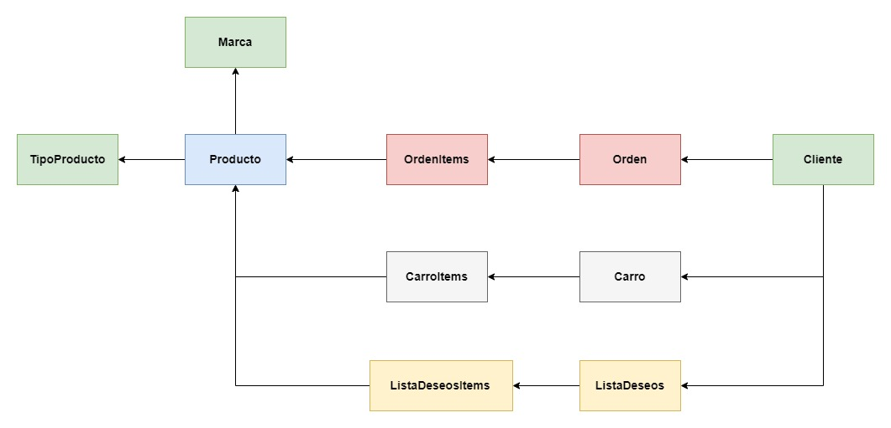

# Sistema de Comercio Electrónico - Danilo Pilacuán

El presente proyecto refleja lo aprendido en el curso de capacitación de netCore, en el presente repositorio se encuentra la solución realizada, en ella se incluye la aplicación de todos los conocimientos adquiridos a lo largo del presente curso, de acuerdo a la especificación del proyecto se presenta el siguiente diagrama para detallar las clases utilizadas para la realización del mismo, cuyas clases adicionales han sido **ListaDeseos** y **ListaDeseosItem** las cuales sirven para la creación de una lista de deseos para cada cliente dentro del sistema de comercio electrónico, además como procesos de negocio se han añadido el control de existencias de los productos, es decir, cuando se añada una instancia de **ItemOrden** se restará la cantidad de productos añadidos del **Producto** cuyo **ProductoId** haya sido incluido en la solicitud, además como segundo proceso de negocio, con la adición de cada **ItemOrden** se recalculará la propiedad **Total** correspondiente a la **Orden** cuyo **OrdenId** haya sido especificado en la solicitud de creación de **ItemOrden**, el diagrama de clases utilizado se presenta a continuación.

